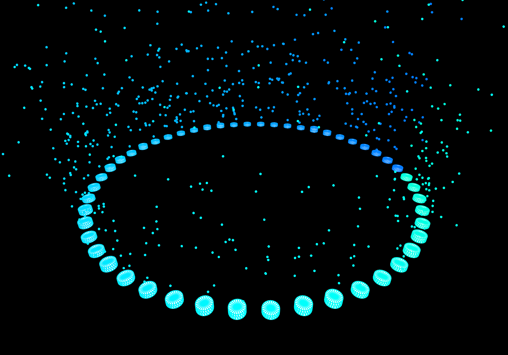

 The visualization starts upon page load, and you can interact by clicking the canvas. It features rotating 3D shapes that dynamically respond to the audio waveform and a field of stars generated in response to the audio.

 